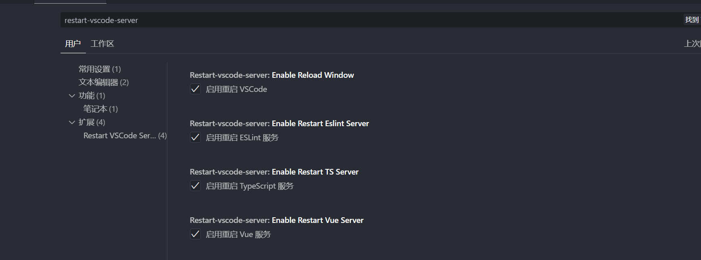

# restart-vscode-server

vscode一个是一个轻量级的 VS Code 扩展，旨在通过一键重启各种服务来简化您的开发工作流程。当您遇到由于缓存、配置更改或服务无响应导致的问题时，无需再完全重启整个编辑器，只需点击一下即可快速恢复。

## ✨ 主要功能

本插件为您提供了一系列独立的重启命令，您可以在需要时精准地重启特定服务：

1. 🔄 **重启 VS Code 窗口 (Reload Window):** 快速重载 VS Code 窗口，应用新的配置或解决界面异常。
2. 🔄 **重启 TypeScript 服务 (Restart TS Server):** 解决类型提示错误、自动补全失效等 TS 相关问题。
3. 🔄 **重启 ESLint 服务 (Restart ESLint Server):** 当 ESLint 规则更新或插件行为异常时，快速重启服务以应用更改。
4. 🔄 **重启 Volar / Vetur 服务 (Restart Vue Server):** 专为 Vue 开发者设计，解决模板语法高亮、组件定义跳转等问题。

## 🚀 如何使用

您可以通过两种便捷的方式来执行重启命令：

### 1. 状态栏快捷按钮

插件会在 VS Code 窗口底部的状态栏添加快捷操作按钮。


### 命令面板

按下快捷键 `Ctrl+Shift+P` (或 macOS 上的 `Cmd+Shift+P`) 打开命令面板，然后输入 `重启` 关键字，即可看到所有可用的重启命令。


## ⚙️ 插件配置

您可以根据个人需求，精细化地控制每个功能的启用与否。

1. 通过设置界面配置
      - 打开 VS Code 设置 (`Ctrl + ,`)。
      - 搜索 `restart-vscode-server`。
      - 勾选或取消勾选您需要启用/禁用的功能。

    

2. 通过 settings.json 配置

    如果您偏爱使用 settings.json 进行配置，可以添加以下代码并按需修改

    ```json
    {
      // 设置为 true 来启用“重启 VS Code 窗口”功能
      "restart-vscode-server.enableReloadWindow": false,

      // 设置为 true 来启用“重启 ESLint 服务”功能
      "restart-vscode-server.enableRestartEslintServer": false,

      // 设置为 true 来启用“重启 TypeScript 服务”功能
      "restart-vscode-server.enableRestartTsServer": false,

      // 设置为 true 来启用“重启 Volar (Vue) 服务”功能
      "restart-vscode-server.enableRestartVueServer": false
    }
    ```

## 🙏 鸣谢

本插件的开发受到了以下优秀项目的启发，并参考了其部分实现。在此向它们的作者表示诚挚的感谢！

- 重启ts和eslint服务插件：[Restart TS/ESLint Server](https://marketplace.visualstudio.com/items?itemName=acoreyj.restart-ts-eslint-server)
- 重启vscode插件：[Reload](https://marketplace.visualstudio.com/items?itemName=natqe.reload)

## 🔗 相关资源

1. vscode内置图标：[codicon](https://microsoft.github.io/vscode-codicons/dist/codicon.html)
2. 插件发布网站：[manage](https://marketplace.visualstudio.com/manage)
